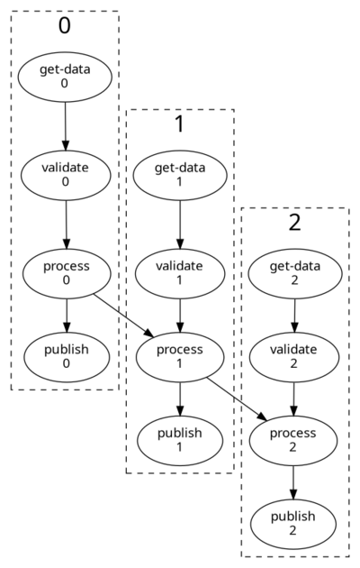
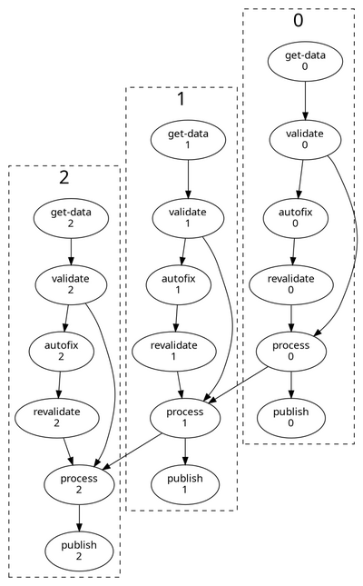

# Writing a Cylc workflow to process many datasets

[Cylc](https://cylc/org) workflows configure a bunch of applications to run as
*tasks* that cooperate via a shared IO workspace, with *dependencies* to
make the tasks run in the right order.

*Cycling workflows* can process arbitrarily many datasets. This is very
efficient in Cylc because
[Cylc has no barrier between cycles](https://cylc.github.io/cylc-doc/stable/html/user-guide/introduction.html#admonition-2).

## Example

The `data` directory in this repository contains 10 simple datasets.

The `bin` directory contains 4 scripts that work with these datasets:
- `validate`: check the validity of a dataset
- `autofix`: automatically fix a common error in a dataset
- `process`: process a dataset to generate a product, and write a summary to stdout
- `publish`: publish a product to a location

Each dataset is supposed to define a `SHAPE` and a `COLOR`:
```
$ cat data/data-0.dat
data
----
COLOR=red
SHAPE=circle
```

Dataset 4 is invalid - it only defines a `COLOR` - so `validate` and `process`
will fail, but it can be fixed (manually or with the `autofix` script).


## The Workflow

The `flow.cylc` file should define a task to run each script, and configure
them to use the shared workspace `$CYLC_WORKFLOW_SHARE_DIR`.

We can use integer cycling with the task cycle point directly corresponding
to the dataset label.

The scripts in this example are easily configured via the command line, so
the full workflow configuration to read all datasets from `~/data/`, validate,
process, publish to `~/products`, and write an ordered processing manifest,
is only 16 lines long (see `flow.cylc.basic`):

```cylc
[scheduling]
    cycling mode = integer
    initial cycle point = 0
    final cycle point = 9
    [[graph]]
        P1 = """get-data => validate => process => publish
                process[-P1] => process"""
[runtime]
    [[get-data]]
        script = "cp ~/data/data-${CYLC_TASK_CYCLE_POINT}.dat ${CYLC_WORKFLOW_SHARE_DIR}/${CYLC_TASK_CYCLE_POINT}.dat"
    [[validate]]
        script = "validate ${CYLC_WORKFLOW_SHARE_DIR}/${CYLC_TASK_CYCLE_POINT}.dat"
    [[process]]
        script = "process ${CYLC_WORKFLOW_SHARE_DIR}/${CYLC_TASK_CYCLE_POINT}.dat ${CYLC_WORKFLOW_SHARE_DIR}/${CYLC_TASK_CYCLE_POINT}.prd >> ~/products/manifest"
    [[publish]]
        script = "publish ${CYLC_WORKFLOW_SHARE_DIR}/${CYLC_TASK_CYCLE_POINT}.prd ~/products/"
```

However, a more readable and flexible workflow results from defining script IO
locations as Jinja2 template variables at the top, and optionally extending the
graph to automatically handle invalid datasets (the `AUTO_FIX` flag):

```cylc 
#!Jinja2






  {# can set from cylc CLI #}

[scheduling]
    cycling mode = integer
    initial cycle point = 0
    final cycle point = 9
    [[graph]]
        P1 = """
            get-data => validate
        
            validate:failed? => autofix => revalidate
            validate? | revalidate => process => publish
        
            validate => process => publish
        
            process[-P1] => process
        """
[runtime]
    [[root]]
        pre-script = sleep 10  # (make the tasks run slower)
    [[get-data]]
        script = "cp {{DATASET_SRC}} {{DATASET_WRK}}"
    [[validate, revalidate]]
        script = "validate {{DATASET_WRK}}"
    [[autofix]]
        script = "autofix {{DATASET_WRK}}"
    [[process]]
        script = "process {{DATASET_WRK}} {{PRODUCT_WRK}} >> {{SUMMARY_FLE}}"
    [[publish]]
        script = "publish {{PRODUCT_WRK}} {{PRODUCT_DIR}}"
```

Note the Jinja2 template code gets processed at start-up - use `cylc view ` to
see the resulting workflow configuration.

### How to run it

Clone this repository to `~/cylc-src/dataproc`:
```
$ git clone git@github.com:hjoliver/cylc-dataset-workflow.git ~/cylc-src/dataproc
```

Copy the `data` directory to `~/data/`. Products will be written to `~/products/`.
To use different data source or product locations just update the `flow.cylc`.

Validate, install, and run the workflow, like this:
```
$ cylc vip --no-detach dataproc
```



Use `cylc tui` or the web UI to monitor progress.

The `validate` task will fail on the invalid dataset 4. This will hold up
downstream tasks, and the workflow will stall once nothing else can run.
To continue, manually fix the dataset in its source location by adding
a `SHAPE` definition, then retrigger the  `get-data` and `validate` tasks
together (so Cylc will respect the dependency between them). The
workflow will then run to completion.
```
$ cylc trigger dataproc //4/get-data //4/validate
```

Now break `~/data/data-4.dat` again in the (by deleting the `SHAPE` line)
and run the workflow again with the "autofix" sub-graph switched on:

```
$ cylc vip --no-detach --set="AUTO_FIX=True" dataproc
```

Now the graph has alternate paths from the `validate:succeeded?` and
`validate:failed?` outputs, to automatically detect and fix invalid datasets
with no manual intervention required.



# Things to note

- The scripts in this example are configured by command line arguments.
Applications that take inputs from the environment can be configured with
`flow.cylc` task `[environment]` sections. For more complex applications,
configuration files should be added to the workflow source directory.
- If new datasets are continually being generated, just delete the
`final cycle point` and the workflow will continue running indefinitely.
- If the datasets are large or many, add housekeeping tasks to
delete files from earlier cycles at runtime.
- If your workflow needs to be distributed across platforms, just add
tasks to the graph to transfer files between platforms as needed
(and understand [Cylc platforms](https://cylc.github.io/cylc-doc/stable/html/7-to-8/major-changes/platforms.html#what-is-a-platform))
- By default Cylc installs workflows under your home directory, but it
can be configured to use another path and symlink that to the standard
home location.
See [Installing workflows](https://cylc.github.io/cylc-doc/stable/html/user-guide/installing-workflows.html).
- Use `cylc clean` to remove workflows once finished - it will also
clean up symlinked locations and other platforms.
- In this example, the inter-cycle dependence `process[-P1] => process`
ensures that the manifest file is correctly ordered, and it "joins up"
the workflow into a single graph. If you remove that, there will be
no dependence between cycles and Cylc will process datasets entirely
in parallel, out to a maximum of 5 at once
[by default](https://cylc.github.io/cylc-doc/stable/html/reference/config/workflow.html#flow.cylc[scheduling]runahead%20limit).

